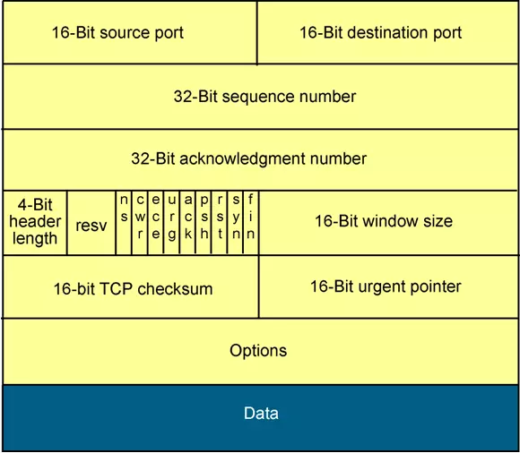

<span style="font-family: Courier New;">

# ARP


+ Destination MAC (6) : mặc định <ins>**0xFF,0xFF,0xFF,0xFF,0xFF,0xFF**</ins>

+ Source MAC PC (6) : địa chỉ nguồn, là địa chỉ của <ins>**ENC28J60**</ins>

+ Ethernet Type (2) : thể hiện đây là bản tin <ins>**ARP (0x08 0x06)**</ins>

+ Htype (2) : hardware type -  Ethernet <ins>**0x00 0x01**</ins> 

+ Ptype (2) : protocol type - IP <ins>**0x00 0x01**</ins> 

+ HLEN (2) : hardware length <ins>**0x06**</ins>

+ PLEN (2) : protocol length <ins>**0x04**</ins>

+ OPRE Request (2) : request <ins>**0x00 và 0x01**</ins>, reply <ins>**0x00 và 0x02**</ins>

+ Sender MAC PC (6) : địa chỉ MAC của ENC28J60

+ Sender IP (4) : địa chỉ của ENC28J60

+ Target MAC (6) : mặc định là <ins>**0x00,0x00,0x00,0x00,0x00,0x00**</ins>

+ Target IP (4) : địa chỉ của PC

# Get mac


Địa chỉ trùng với địa chỉ MAC và IP của cài đặt. PC đã lấy được địa của MAC và IP của ENC28J60

# Struct

```c
typedef struct
{
	uint8_t MAC_dest[6];             		// MAC destination
	uint8_t MAC_source[6];                  // MAC source
	uint16_t Ethernet_type;                 // Ethernet type
	uint16_t Hardwave_type;                 // Hardwave type
	uint16_t Protocol_type;                 // Protocol type (ARP)
	uint16_t Size;                          // Size
	uint16_t Opcode;                        // Opcode
	uint8_t MAC_sender[6];                  // Sender MAC
	uint8_t IP_sender[4];                   // Sender IP
	uint8_t MAC_target[6];                  // Target MAC
	uint8_t IP_target[4];                   // Target IP
}ARP_Struct;
```

# 2. UDP


# 3. UDP


# 4. TCP IP

+ TCP là giao thức truyền tải hướng kết nối (connection-oriented), nghĩa là phải thực hiện thiết lập kết nối với đầu xa trước khi thực hiện truyền dữ liệu. Tiến trình thiết lập kết nối ở TCP được gọi là tiến trình bắt tay 3 bước (threeway handshake).

+ Cung cấp cơ chế báo nhận (Acknowledgement) :Khi A gửi dữ liệu cho B, B nhận được thì gửi gói tin cho A xác nhận là đã nhận. Nếu không nhận được tin xác nhận thì A sẽ gửi cho đến khi B báo nhận thì thôi.

+ Cung cấp cơ chế đánh số thứ tự gói tin (sequencing) cho các đơn vị dữ liệu được truyền, sử dụng để ráp các gói tin chính xác ở điểm nhận và loại bỏ gói tin trùng lặp.
Có các cơ chế điều khiển luồng thích hợp (flow control) để tránh nghẽn xảy ra.

+ Hỗ trợ cơ chế full-duplex ( truyền và nhận dữ liệu cùng một lúc)
Phục hồi dữ liệu bị mất trên đường truyền ( A gửi B mà không thấy xác nhận sẽ gửi lại) .



***Source port*** : Số hiệu của cổng tại máy tính gửi

***Destination port*** : Số hiệu của cổng tại máy tính nhận.

***Sequence number*** : Trường này có 2 nhiệm vụ. Nếu cờ SYN bật thì nó là số thứ tự gói ban đầu và byte đầu tiên được gửi có số thứ tự này cộng thêm 1. Nếu không có cờ SYN thì đây là số thứ tự của byte đầu tiên

***Acknowledgement number*** Nếu cờ ACK bật thì giá trị của trường chính là số thứ tự gói tin tiếp theo mà bên nhận cần.

***Data offset*** Trường có độ dài 4 bít quy định độ dài của phần header (tính theo đơn vị từ 32 bít). Phần header có độ dài tối thiểu là 5 từ (160 bit) và tối đa là 15 từ (480 bít).

***Reserved*** Dành cho tương lai và có giá trị là 0

***Flags*** (hay Control bits) : URG ACK PSH RST SYN FIN

***Window*** Số byte có thể nhận bắt đầu từ giá trị của trường báo nhận (ACK)

***Checksum*** : 16 bít kiểm tra cho toàn bộ gói TCP và 1 phần của gói IP

***Urgent pointer*** Nếu cờ URG bật thì giá trị trường này chính là số từ 16 bít mà số thứ tự gói tin (sequence number) cần dịch trái.

***Options*** Đây là trường tùy chọn. Nếu có thì độ dài là bội số của 32 bít.

Dữ liệu Dữ liệu của gói TCP

# 4.1 Tcp Operation


+ ***Bước 1*** : Host A gửi cho B một gói tin có cờ SYN được bật lên, với số thứ tự được đánh là 100. Segment đầu tiên này không chứa phần dữ liệu nên không có phần data, tuy nhiên số lượng byte dữ liệu vẫn được tính là một byte cho hoạt động gửi cờ SYN.

# 4.1 Tcp receive

+ **Phản hồi lại ACK cho client**

Khi nhận được gói tin, chúng ta bắt buộc phải phản hồi lại cho client bằng cờ ACK


</span>