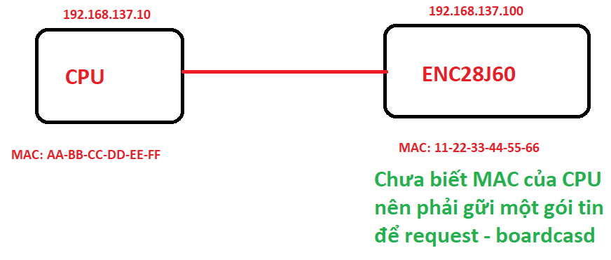
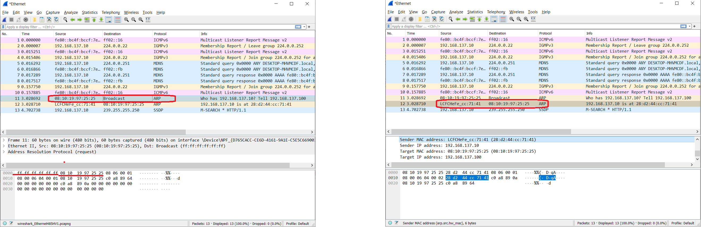
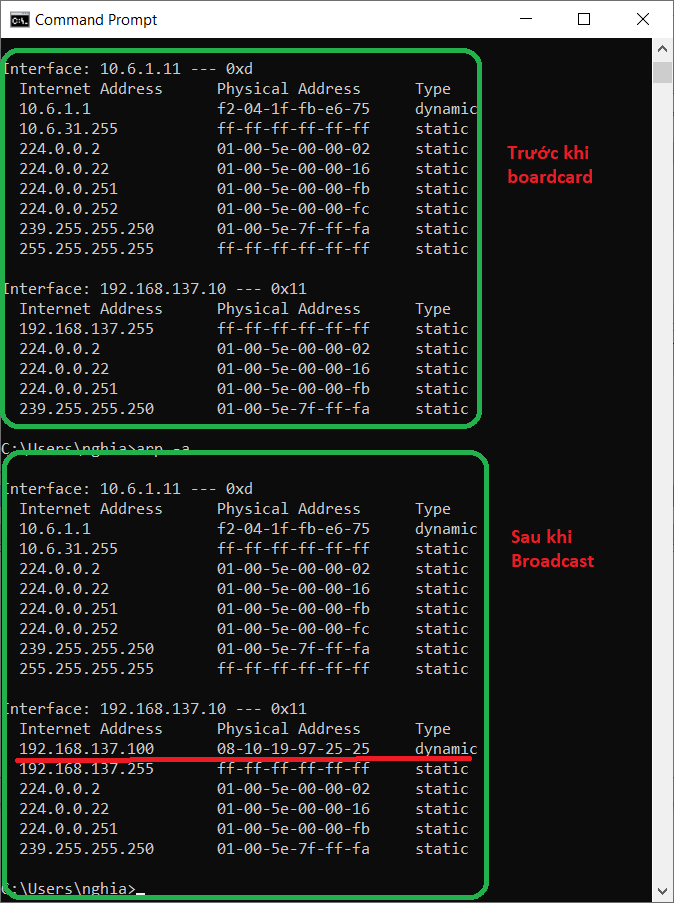

<span style="font-family: Courier New;">

# ARP






+ Destination MAC (6) : mặc định <ins>**0xFF,0xFF,0xFF,0xFF,0xFF,0xFF**</ins>

+ Source MAC PC (6) : địa chỉ nguồn, là địa chỉ của <ins>**ENC28J60**</ins>

+ Ethernet Type (2) : thể hiện đây là bản tin <ins>**ARP (0x08 0x06)**</ins>

+ Htype (2) : hardware type -  Ethernet <ins>**0x00 0x01**</ins> 

+ Ptype (2) : protocol type - IP <ins>**0x00 0x01**</ins> 

+ HLEN (2) : hardware length <ins>**0x06**</ins>

+ PLEN (2) : protocol length <ins>**0x04**</ins>

+ OPRE Request (2) : request <ins>**0x00 và 0x01**</ins>, reply <ins>**0x00 và 0x02**</ins>

+ Sender MAC PC (6) : địa chỉ MAC của ENC28J60

+ Sender IP (4) : địa chỉ của ENC28J60

+ Target MAC (6) : mặc định là <ins>**0x00,0x00,0x00,0x00,0x00,0x00**</ins>

+ Target IP (4) : địa chỉ của PC

# Get mac



Địa chỉ trùng với địa chỉ MAC và IP của cài đặt. PC đã lấy được địa của MAC và IP của ENC28J60

```c
#include "use.h"
#include "arp.h"

uint8_t mac_source[6] = {0x08,0x10,0x19,0x97,0x25,0x25};
uint8_t ip_source[4] = {192,168,137,100};

uint8_t mac_target[6] = {0x00,0x00,0x00,0x00,0x00,0x0};
uint8_t ip_target[6] = {192,168,137,10};

extern void setup(void){
	arp_init(mac_source, ip_source);
	arp_get_mac(mac_target, ip_target);
}

extern void loop(void){
}
```


# Struct

```c
typedef struct
{
	uint8_t MAC_dest[6];             		// MAC destination
	uint8_t MAC_source[6];                  // MAC source
	uint16_t Ethernet_type;                 // Ethernet type
	uint16_t Hardwave_type;                 // Hardwave type
	uint16_t Protocol_type;                 // Protocol type (ARP)
	uint16_t Size;                          // Size
	uint16_t Opcode;                        // Opcode
	uint8_t MAC_sender[6];                  // Sender MAC
	uint8_t IP_sender[4];                   // Sender IP
	uint8_t MAC_target[6];                  // Target MAC
	uint8_t IP_target[4];                   // Target IP
}ARP_Struct;
```

# Tx

</span>